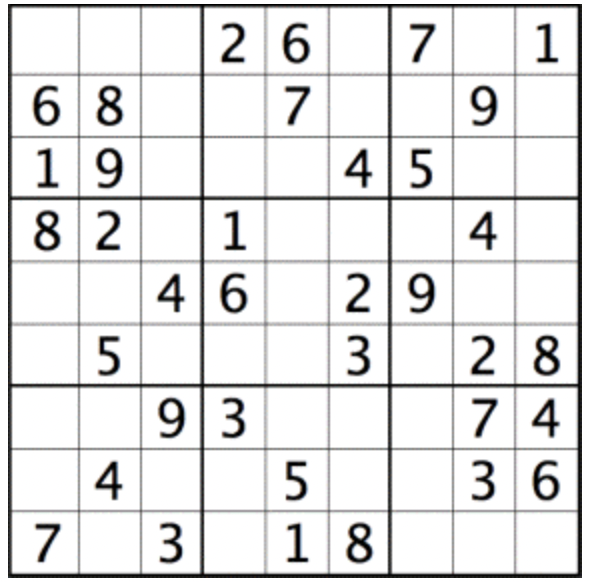
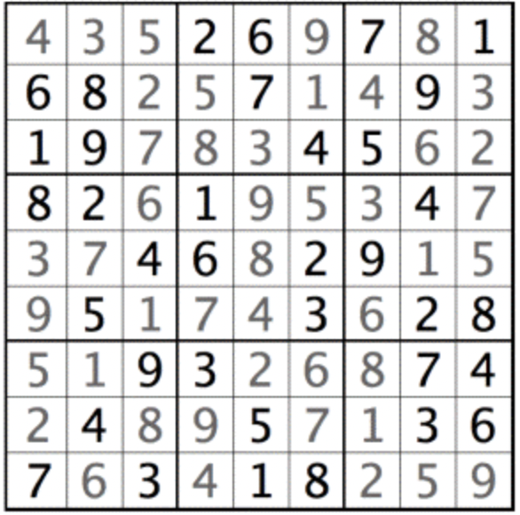

## Coding challenge 

Your assignment is to build a single game of [Sudoku](https://en.wikipedia.org/wiki/Sudoku) in the browser using React.

The goal of Sudoku is to fill out a 9×9 grid with digits so that each column, each row, and each of the nine 3×3 subgrids that compose the grid (also called "boxes", "blocks", or "regions") contain all of the digits from 1 to 9.

The product requirements are as follows:
* The player can play a game from start to finish.
* The player can validate whether or not there are errors on the board by clicking a button with the text "Check answers".
* An error message should be displayed if any of the three following conditions are met:
  - a column contains duplicate numbers
  - a row contains duplicate numbers
  - one of the nine 3x3 subgrids that compose the grid contains duplicate numbers
* If there are no errors on the board and the board is unfinished, no message should be displayed and any existing error message should be cleared when the user checks their answers.
* If there are no errors on the board and the board is finished, the player should be shown a message with the text "Completed!" when the the user checks their answers.

Below you can find a valid starting board as well as the correct answers to validate against. Do not spend time creating your own board and answer set.

Starting board:

Answers:

Do not spent more than 3 hours on this project. Do not worry about adding functionality not listed in the product requirements. Do not spend a lot of time on styling.

Please upload your finished project to a Github repo and send to Robert at robert@coilelectric.com. Should you need anything clarified please use that same email. Questions are welcome!
